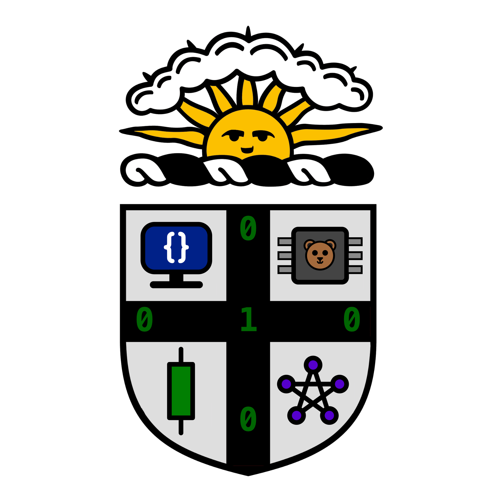

# Brown Applied Computing Software Project
This is the Spring 2023 Brown Applied Computing software project. We are demonstrating innovative approaches to AI-generated content and security. To do this, we are making an educational workshop about cryptography and machine learning.

# Plan
Our plan is not set in stone. Edit the [Google doc plan](https://docs.google.com/document/d/1_AmFrudoSJa6s30vHYEYI6L1M-KW2zWXDtEwJlGhOCQ/edit?usp=sharing) as we try different things and come up with new ideas. For now, our general plan is as follows.
1. ~~Implement a simplified DSA signature scheme in Python.~~ (Done! See `ai-security/secure.py`.)
2. Adapt a voice deepfake or other AI deepfake in Python.
3. Implement a scheme whereby entities can securely sign real recordings and AI-generated recordings.
4. Create a fun educational workshop that teaches how these deepfakes work and possible solutions to prevent them.
5. Run the workshop open to all students.
<!-- physical address and instructions -->

# Significance
As AI becomes more powerful, it has become difficult to tell the difference between human-created and AI-created content. So far, attempted solutions have usually tried to analyze the content itself and look for signs of AI generation. However, as AI improves, this arms race will become more and more difficult. It is possible that no perfect solution exists.

Generative AI necessitates a way to verify human-generated content from reputable sources and avoid the spread of misinformation. Cryptographic signatures provide a mathematically secure way to do this. In this project, we aim to implement a simplified version of such a protocol, as well as discuss the pros and cons of different methods to combat deepfakes. In the end, our goal is to not only implement such a protocol ourselves but also educate other students about these important issues through a workshop.

# Technical Details
The technical details for this project are always changing, and for now will be most up to date in our [Google doc plan](https://docs.google.com/document/d/1_AmFrudoSJa6s30vHYEYI6L1M-KW2zWXDtEwJlGhOCQ/edit?usp=sharing).
